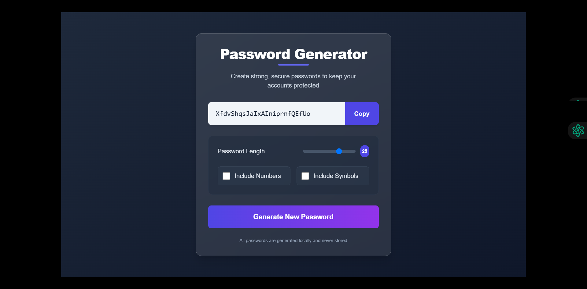

# Password Generator

A modern, secure password generator built with React and Tailwind CSS.



## Features

- Generate random passwords with customizable options
- Adjust password length (8-32 characters)
- Include or exclude numbers
- Include or exclude special characters
- Copy passwords to clipboard with a single click
- Responsive design that works on all devices
- Modern UI with a clean design

## Technologies Used

- React.js
- Tailwind CSS
- Vite

## Installation

1. Clone the repository:
```bash
git clone https://github.com/yourusername/password-generator.git
cd password-generator
```

2. Install dependencies:
```bash
npm install
```

3. Run the development server:
```bash
npm run dev
```

4. Open your browser and navigate to:
```
http://localhost:5173
```

## Building for Production

To create an optimized production build:

```bash
npm run build
```

The build files will be stored in the `dist/` directory.

## How It Works

The application uses JavaScript's Math.random() function to generate random characters from a set of allowed characters (uppercase letters, lowercase letters, numbers, and special characters based on user selection).

```jsx
const passwordGenerator = useCallback(() => {
  let pass = '';
  let string = 'ABCDEFGHIJKLMNOPQRSTUVWXYZabcdefghijklmnopqrstuvwxyz';
  
  if(numberAllowed) string += '0123456789';
  if(charAllowed) string += '!@#$%^&*()_+-=[]{}|;,.<>/?`~';
  
  for (let i = 1; i <= length; i++) {
    let char = Math.floor(Math.random() * string.length);
    pass += string.charAt(char);
  }
  
  setPassword(pass);
}, [length, numberAllowed, charAllowed, setPassword]);
```

## Security Considerations

- All password generation happens client-side, directly in your browser
- No passwords are stored or transmitted to any server
- For maximum security, you can run this application offline after installation

## Customization

You can easily customize the UI by modifying the Tailwind CSS classes in the App.jsx file.

## License

This project is licensed under the MIT License - see the [LICENSE](LICENSE) file for details.

## Contributing

1. Fork the repository
2. Create your feature branch: `git checkout -b feature/amazing-feature`
3. Commit your changes: `git commit -m 'Add some amazing feature'`
4. Push to the branch: `git push origin feature/amazing-feature`
5. Open a Pull Request

## Acknowledgments

- [React](https://reactjs.org/)
- [Tailwind CSS](https://tailwindcss.com/)
- [Vite](https://vitejs.dev/)
